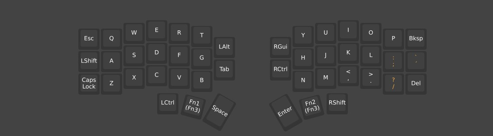
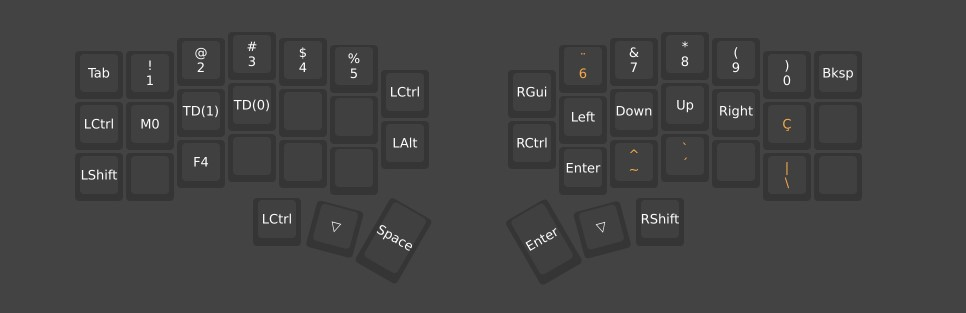
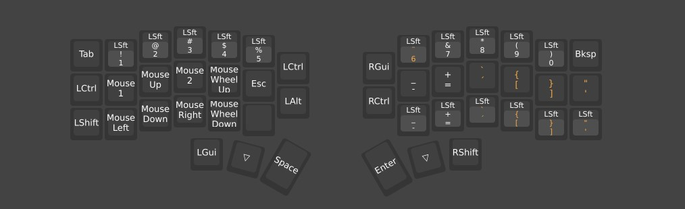

# Corne Split Keyboard Config

This repository contains my Corne split keyboard layout configuration.

## Layers

### Layer 1
Base typing layer used for daily typing.

### Layer 2
Symbols and numbers layer for coding and shortcuts.

### Layer 3
Navigation and function layer for system controls and media keys.

